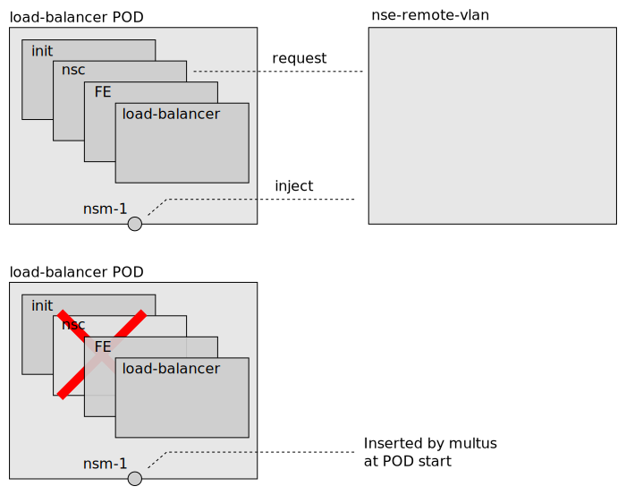

# Multus in Meridio

The Frontend (FE) must have an interface to the external network. The
interface can be created in several ways. In Meridio we use either the
NSM `nse-remote-vlan` service endpoint or [Multus](
https://github.com/k8snetworkplumbingwg/multus-cni).

It is important to note that the FE is unaware of how the interface is
created, it just uses the interface. If Multus is used the network
service client (nsc) is not needed and is removed from the
load-balancer POD.

